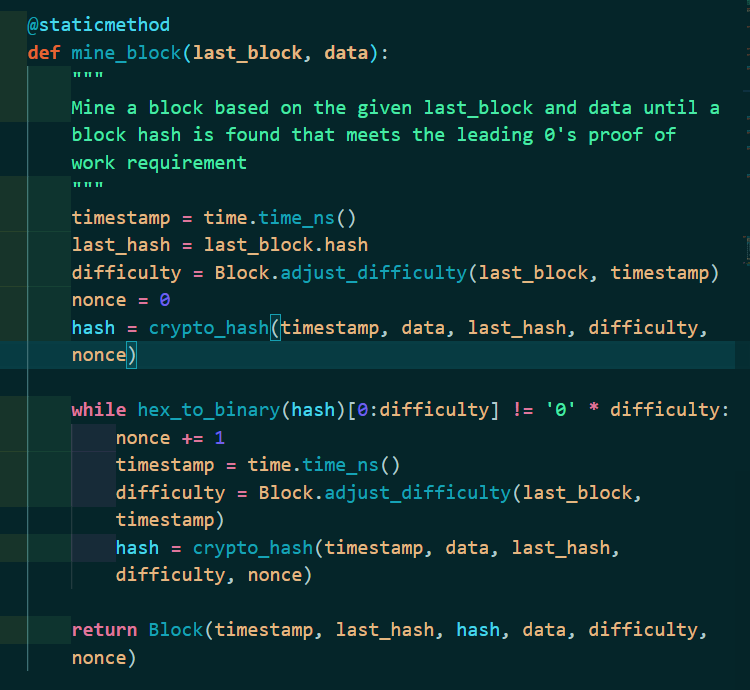

Thanks for taking a look at my blockchain project from my recent coursework. This app is from a [course](https://www.udemy.com/course/python-js-react-blockchain/) I took by David Katz after doing a Python bootcamp. As simplistic as it looks, this app is actually a working blockchain and cryptocurrency with the usual functionalities of:

 - Block Mining with Proof of Work
 - Difficulty Adjustment
 - Transactions
 - Transaction Validation
 - Block Validation
 - Chain Validation



**Activate the virtual environment**

```
source blockchain-env/Scripts/activate
```
**Install all packages**

```
pip install -r requirements.txt     
```
**Run the tests**

Make sure to activate the virtual environment

```
python -m pytest backend/tests    
```
**Run the application and API**

Make sure to activate the virtual environment

```
python -m backend.app    
```

**Run a peer instance**

Make sure to activate the virtual environment

```
export PEER=True && python -m backend.app    
```

**Run the frontend**

In the frontend directory:
```
npm run start    
```

**Seed the backend with data**

Make sure to activate the virtual environment


```
export SEED_DATA=True && python -m backend.app    
```
